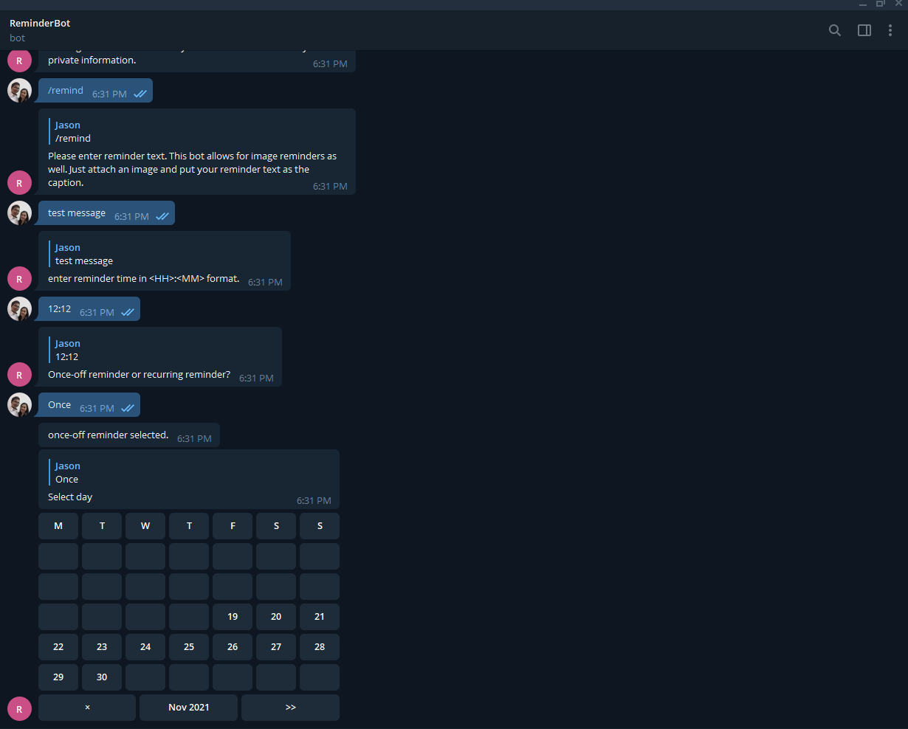

# Telegram reminder bot

[](https://github.com/Jason-CKY/telegram-reminderbot/actions/workflows/ci.yaml)

Telegram bot that sends you text/image reminders in both personal message or groups.

All the time information is stored in UTC inside the database, and is converted into the group's timezone when rendering it.

## Reminder frequencies

- once off reminder
- every day
- every week
- every month

## Available commands

```text
/start or /help:    Help on how to use this Bot
/remind:            Start a reminder
/list:              Get a list of reminders
/settings:          View/Change settings
/support:           Link back to this repo
```

## Screenshots


